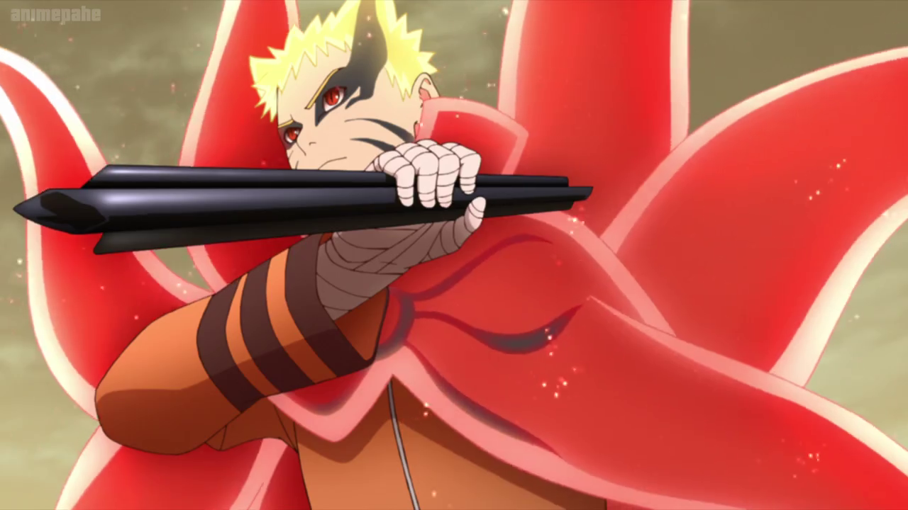
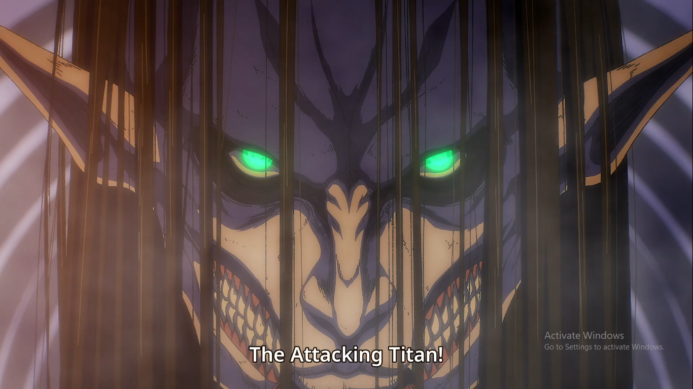
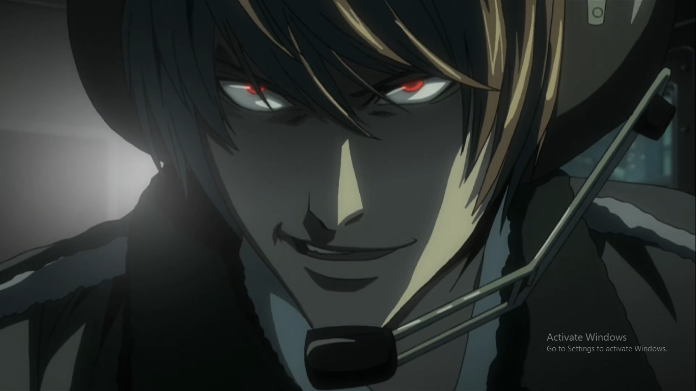
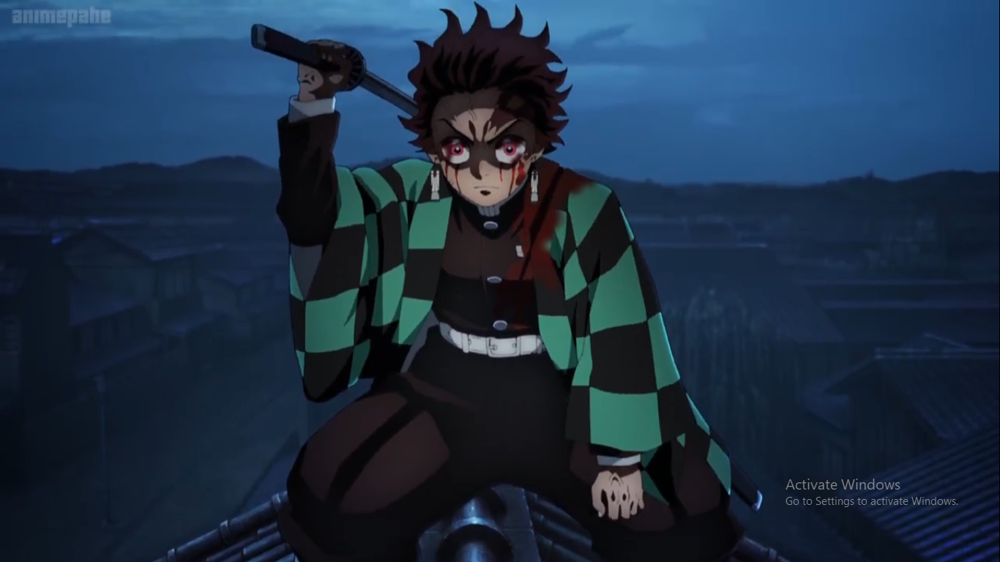

# tirmixi.github.io
new site 
<!DOCTYPE html>
<html lang="en" dir="ltr">

<head>
  <meta charset="utf-8">
  <title>AHIBASH</title>

</head>

<body>
  

    <h1><strong> AHIBASH EXPLAINER</strong></h1>
     
    <h3><em>firstly today we will bring to you our top 5 best anime list</em></h3>
  

  <OL>
    <table CELLSPACING="30">
      <tr>
        <td>
          <ol type="1">
            <li><strong>Naruto</strong></li>
            
        </td>
        <td>
          
Twelve years before the start of the series,
            the Nine-Tails attacked Konohagakure destroying much of the village and taking many lives.

          
leader of the village, the Fourth Hokage, sacrificed his life to seal the Nine-Tails into a newborn,
            Naruto Uzumaki.

          
 Orphaned by the attack, Naruto was shunned by the villagers, who out of fear and anger,
            viewed him as the Nine-Tails itself. 

          
 Though the Third Hokage outlawed speaking about anything related to the Nine-Tails,
            the children — taking their cues from their parents

          
inherited the same animosity towards Naruto. In his thirst to be acknowledged,
            Naruto vowed he would one day become the greatest Hokage the village had ever seen.

        </td>
      </tr>
    </table>
    <h3>RELEASE DATE</h3>
    <table>
      <thead>
        <tr>
          <th>DATE</th>
          <th>month</th>
        </tr>
      </thead>
      <tbody>
        <tr>
          <td>2002</td>
          <td>december</td>
        </tr>
      </tbody>
    </table>
    

    <table CELLSPACING="30">
      <tr>
        <td>
          <li><strong>Attack on titan</strong></li>
          
        </td>
        <td>
          
"That day, the human race remembered the terror of being dominated by them,
            and the shame of being held captive in a birdcage..." — Over 100 years ago,

          
a natural predator of humanity appeared: the Titans,
            giant humanoid but mindless monsters whose sole purpose of existence seemed to be to devour humans.

          
There was an insurmountable gap in power between them and mankind, and as a result,
            humanity was rapidly exterminated to the brink of extinction.
            The survivors responded by constructing three concentric walls: Wall Maria

          
Wall Rose and Wall Sina, which graced them with a century of peace. However,
            one day a Colossal Titan far larger than any other seen before breached the outer wall,
            allowing the smaller Titans to invade the human territory and forcing the survivors
            to retreat to the inner walls.

          
Eren Jaeger, a boy whose mother was eaten during the invasion,
            vowed to wipe every last Titan off the face of the Earth, and joined the military determined to exact his revenge.

        </td>
      </tr>
    </table>

    <h3>RELEAESE DATE</h3>
    <table>
      <thead>
        <tr>
          <th>DATE</th>
          <th>month</th>
        </tr>
      </thead>
      <tbody>
        <tr>
          <td>2013</td>
          <td>october</td>
        </tr>
      </tbody>
    </table>
    

    <table CELLSPACING="30">
      <tr>
        <tbody>
          <td>
            <li><strong>Death note</strong></li>
            
          </td>
          <td>
            
Based on the famous Japanese manga written by Tsugumi Ohba and Takeshi Obata,
              Death Note follows a high school student who comes across a supernatural notebook

            
 realizing it holds within it a great power;
              if the owner inscribes someone's name into it while picturing their face, he or she will die.

          </td>
        </tbody>
      </tr>
    </table>

    <h3>RELEASE DATE</h3>
    <table>
      <thead>
        <tr>
          <th>DATE</th>
          <th>MONTH</th>
        </tr>
      </thead>
      <tbody>
        <tr>
          <td>2010</td>
          <td>JANUARY</td>
        </tr>
      </tbody>
    </table>
    

    <table CELLSPACING="30">
      <tr>
        <td>
          <li><strong>Demon slayer</strong></li>
          
        </td>
        <td>
          
Set in Taisho-era Japan, Demon Slayer's plot follows the epic saga of Tanjirou Kamado,
            a kind-hearted teen who, upon returning home one day, finds his entire family slaughtered by invading demons

          
Worst of all, he finds that his sister, Nezuko, has been turned into a bloodthirsty demon herself

        </td>
      </tr>
    </table>
    <h3>RELEASE DATE</h3>
    <table>
      <thead>
        <tr>
          <th>DATE</th>
          <th>MONTH</th>
        </tr>
      </thead>
      <tbody>
        <tr>
          <td>2019</td>
          <td>SEPTEMBER</td>
        </tr>
      </tbody>
    </table>
    

    <table CELLSPACING="30">
      <tr>
        <td>
          <li><strong>Black clover</strong></li>
          
        </td>
        <td>
          
The series focuses on Asta, a young orphan who is left to be raised in an orphanage alongside his fellow orphan, Yuno.

          
While everyone is born with the ability to utilize mana in the form of magical power,

          
Asta, with no magic however, instead focuses on physical strength.

        </td>
      </tr>
    </table>

    <h3>RELEASE DATE</h3>
    <table>
      <thead>
        <tr>
          <th>DATE</th>
          <th>DATE</th>
        </tr>
      </thead>
      <tbody>
        <tr>
          <td>2016</td>
          <td>NOVEMBER</td>
        </tr>
      </tbody>
    </table>
     
    <a href="https://www.youtube.com/c/XAhibash/videos">AHIBASH Youtube Channel</a>
  </ol>

  <form action="mailto:iabashir10@gmail.com" method="post" enctype="text/plain">
    <label>your best anime</label>
    <input type="text" name="tThe anime:" value=""> 
    <label>Did you like it</label>
    <input type="checkbox" name="" value=""> 
    <label>your answer</label>
  <textarea name="Your answer" rows="20" cols="40"></textarea> 
  <input type="date" name="DATE" value=""> 

    <input type="submit" name="">

  </form>

</body>

</html>
